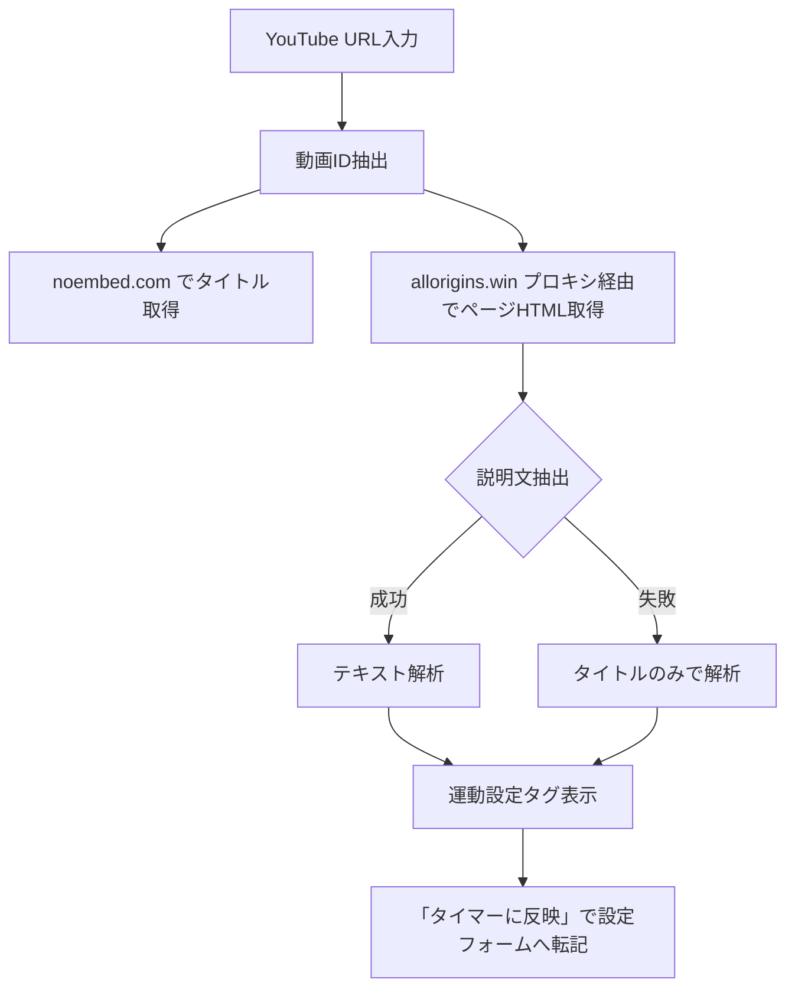

# 運動タイマーアプリ 仕様変更ログ

> [!info] 関連ドキュメント
> 元の仕様書 → [[運動タイマーアプリ_仕様書プロンプト]]
> 実装ファイル → `index.html`（単一HTMLファイル）

---

## 変更概要

| # | 機能 | 種別 | 状態 |
|---|------|------|------|
| 1 | フェーズ分割タイマー | 追加 | ✅ 完了 |
| 2 | YouTube連携（URL解析・埋め込み） | 追加 | ✅ 完了 |
| 3 | YouTube エラー153対応 | 修正 | ✅ 完了 |
| 4 | ワークアウトリスト（連続再生） | 追加 | ✅ 完了 |
| 5 | YouTubeとワークアウットの紐付け保存 | 追加 | ✅ 完了 |
| 6 | デフォルトワークアウト「有酸素運動20種」 | 追加 | ✅ 完了 |
| 7 | 音声通知の見直し | 修正 | ✅ 完了 |
| 8 | 保存済みメニューのインライン編集 | 追加 | ✅ 完了 |
| 9 | デフォルトプリセット20種の自動登録 | 追加 | ✅ 完了 |
| 10 | ワークアウトリストへの保存メニュー選択追加 | 追加 | ✅ 完了 |
| 11 | ワークアウトリスト時の休憩時間バグ修正 | 修正 | ✅ 完了 |
| 12 | 有酸素運動20種のデフォルト回数修正（10回→1回） | 修正 | ✅ 完了 |
| 13 | 運動中・休憩中のパネル操作ロック | 追加 | ✅ 完了 |
| 14 | 音声読み上げ（Web Speech API） | 追加 | ✅ 完了 |
| 15 | 励ましの音声読み上げ | 追加 | ✅ 完了 |
| 16 | ずんだもん音声（MP3）対応 | 追加 | ✅ 完了 |

---

## 変更詳細

### 1. フェーズ分割タイマー

> [!tip] 変更理由
> 「1回あたりの秒数」が単一値しか設定できず、しゃがむ・立つなど動作フェーズごとに異なるリズムを設定したいというニーズに対応。

#### 元の仕様
- 1回あたりの秒数：単一値（例：3秒）

#### 新仕様
- **フェーズ分割トグル**（設定パネル内）で ON/OFF 切替
- **OFF（デフォルト）**：従来通り単一秒数
- **ON（フェーズ分割モード）**：

| 設定項目 | 説明 | 例 |
|----------|------|-----|
| フェーズ1 名前 | 前半動作の名前 | しゃがむ |
| フェーズ1 秒数 | 前半の持続時間 | 3秒 |
| フェーズ2 名前 | 後半動作の名前 | たつ |
| フェーズ2 秒数 | 後半の持続時間 | 2秒 |

#### UI仕様
- リングカラー：**フェーズ1 = 緑（`#c8f57a`）** / **フェーズ2 = 金色（`#f5c87a`）** に切り替わる
- 指示テキスト：フェーズ名をリアルタイム表示（「しゃがむ」「たつ」）
- リング中央のフェーズバッジ：`フェーズ1` / `フェーズ2` ラベルを表示
- 時間表示（アイドル時）：`3＋2 / 回` のように両フェーズ合計を表示
- フェーズ切り替え音：柔らかいビープ音（660Hz / 0.08秒）

---

### 2. YouTube連携

> [!tip] 変更理由
> YouTubeの運動動画URLを入力するだけで運動設定を自動取得し、動画を見ながらタイマーを使えるようにしたい。

#### 新機能：設定パネル内「YouTube連携」セクション

```
URL入力 → 解析 → 設定自動反映 + 動画埋め込み
```

##### URL解析フロー



##### テキスト解析ルール

| 抽出項目 | パターン例 | 対応正規表現 |
|----------|-----------|-------------|
| 運動名 | スクワット、プランク 等 | 20種類以上のキーワード辞書 |
| 秒数 | 30秒、30sec | `(\d+)\s*秒` |
| 回数 | 10回 | `(\d+)\s*回` |
| セット数 | 3セット、3set | `(\d+)\s*セット` |
| 休憩時間 | 休憩30秒 | `休憩\s*(\d+)\s*秒` |

##### 手動入力フォールバック
- API取得失敗時は「説明文を手動で貼り付け」テキストエリアから解析可能

##### 動画埋め込み
- 解析成功時にヘッダーの **▶ ボタン** が出現
- タップでパネル開閉（16:9 比率でインライン表示）
- パネルを閉じると動画は一時停止

---

### 3. YouTube エラー153対応

> [!bug] 発生した問題
> `<iframe src="...">` で直接埋め込むと、埋め込み無効動画で「エラー 153 動画プレーヤーの設定エラー」が表示されるだけで、ユーザーに状況が伝わらなかった。

#### 修正内容
- **YouTube IFrame Player API** に切り替え（`https://www.youtube.com/iframe_api`）
- `onError` イベントで各エラーコードに対応した日本語メッセージを表示

| エラーコード | 意味 | 表示メッセージ |
|-------------|------|---------------|
| 2 | 無効な動画ID | 動画IDが無効です。URLを確認してください。 |
| 100 | 動画が存在しない | 動画が見つかりません（削除または非公開）。 |
| 101 / 150 / **153** | 埋め込み無効 | この動画は埋め込み再生が無効に設定されています。 |

- エラー時は「**YouTubeで開く**」リンクを表示（別タブで開く）
- パネルを閉じるときは `player.pauseVideo()` で正しく一時停止

---

### 4. ワークアウットリスト（連続再生）

> [!tip] 変更理由
> 複数の運動を順番に並べて、1回の操作で全種目を連続再生したい。

#### 新機能：ヘッダーの ☰ ボタン（ワークアウットパネル）

##### ワークアウットパネル構成

```
┌──────────────────────────────┐
│  ワークアウットリスト      ✕  │
├──────────────────────────────┤
│  [＋ 現在の設定をリストに追加] │
├──────────────────────────────┤
│  リスト編集                   │
│  ① その場で足踏み  ↑↓ ✕    │
│  ② ニーアップ      ↑↓ ✕    │
│  ...                          │
├──────────────────────────────┤
│  [▶ ワークアウット開始]       │
├──────────────────────────────┤
│  保存・読み込み               │
│  [名前入力]        [保存]     │
│  YouTube URL（任意）          │
│  [URL入力フィールド]          │
├──────────────────────────────┤
│  ▶YT 有酸素運動20種  20種目 ✕ │
└──────────────────────────────┘
```

##### 連続再生フロー


##### 遷移画面（種目間カウントダウン）

```
╔══════════════════════════════╗
║  完了                        ║
║  スクワット                  ║
║       ✓                      ║
║  ─────────────               ║
║  次の運動                    ║
║  腕立て伏せ                  ║
║  2 / 20 種目                 ║
║                              ║
║         3                   ║  ← カウントダウン
║                              ║
║  [今すぐ開始]                ║
╚══════════════════════════════╝
```

- 「今すぐ開始」でスキップ可能
- 遷移音：セット終了と同じビープ音

##### メインUI変更
- ワークアウット再生中は運動名の上に **「種目 X / N」** バッジを表示

##### データ構造（localStorage）

```json
// キー: exTimer_workoutLists
[
  {
    "name": "有酸素運動20種",
    "youtubeId": "xxxxxxxxxxx",
    "youtubeTitle": "動画タイトル",
    "list": [
      { "name": "その場で足踏み", "secs": 20, "reps": 20, "sets": 1, "rest": 10, ... },
      ...
    ]
  }
]
```

---

### 5. YouTubeとワークアウットの紐付け保存

> [!tip] 変更理由
> ワークアウットと参考にした動画をセットで管理・再現できるようにしたい。

#### 仕様
- ワークアウット保存時に **YouTube URL欄**（任意）を入力
- `youtubeId` と `youtubeTitle` を一緒にlocalStorageへ保存
- 読み込み時：YouTube動画が自動的に埋め込みパネルに表示される
- 保存済みリスト表示：YouTube連携があるワークアウットに **▶YT** バッジを表示

---

### 6. デフォルトワークアウット「有酸素運動20種」

> [!tip] 変更理由
> 初回起動時からすぐに使えるワークアウットを用意してほしいというリクエスト。

#### 登録内容
- **初回起動時のみ**自動でlocalStorageに書き込み（2回目以降はスキップ）
- 全20種目、共通設定：**20秒 × 20回 × 1セット・休憩10秒**

| No. | 運動名 | No. | 運動名 |
|-----|--------|-----|--------|
| 1 | その場で足踏み | 11 | サイドホップ |
| 2 | ニーアップ | 12 | 前方ランジ |
| 3 | バットキック | 13 | アッパーカット |
| 4 | サイドからニーアップ | 14 | スタンディングアブズ |
| 5 | ショルダープレス | 15 | スタンディングサイドクランチ |
| 6 | 肩甲骨寄せ&剥がし | 16 | 逆腹筋 |
| 7 | アームサークル横 | 17 | 股割りストレッチ |
| 8 | アームサークル上 | 18 | ハーフスクワット |
| 9 | 風車 | 19 | スクワット&リーチ |
| 10 | カーフレイズ | 20 | ワイドスクワット |

> [!note]
> YouTube URLは未設定の状態で登録されています。動画URLを紐付けたい場合は、☰ パネルで読み込み後、URLを入力して「保存」し直してください。

---

### 7. 音声通知の見直し

> [!tip] 変更理由
> 毎秒ビープは情報過多で煩わしく、スタート時に音がなかったためわかりにくかった。

#### 変更内容

| 変更種別 | 内容 |
|----------|------|
| 削除 | 毎秒ティック音（通常 1100Hz / 残り3秒 1400Hz） |
| 変更 | カウント切り替わり音：単音（880Hz）→ 上昇2音「ピポッ」（660Hz→880Hz、80ms間隔） |
| 追加 | スタートボタン押下時：上昇3音「ド→ミ→ソ」（523→659→784Hz、80ms間隔） |
| 追加 | ワークアウト開始ボタン押下時：同上の上昇3音 |

#### 音声一覧（更新後）

| タイミング | 音 | 備考 |
|-----------|-----|------|
| スタート / ワークアウット開始 | ド→ミ→ソ（3音上昇） | 新規スタートのみ。一時停止再開時は鳴らない |
| カウント切り替わり | ピポッ（2音上昇） | 各レップ開始時 |
| フェーズ切り替わり | 柔らかいビープ（660Hz） | フェーズモードON時のみ |
| セット終了 | 2音ビープ（660Hz+880Hz） | 休憩開始時 |
| 全完了 | 達成音4音（ド→ミ→ソ→高ド） | ワークアウット完了時も同様 |

---

## 変更されなかった仕様

以下の元仕様はそのまま維持されています。

- 単一HTMLファイル構成
- ダークテーマ・アクセントカラー `#c8f57a`
- Web Audio API による音声通知（カウント・セット終了・完了）
- localStorage によるデータ保存（ログイン不要）
- スマホファースト（`max-width: 480px`）
- Google Fonts（Zen Kaku Gothic New / JetBrains Mono）
- SVGプログレスリング・パルスエフェクト
- ミュートボタン
- 個別運動プリセット保存・呼び出し（設定パネル内）

---

### 8. 保存済みメニューのインライン編集

> [!tip] 変更理由
> 保存済みプリセットの値を修正するには一度読み込んで設定を変更し再保存する手間があった。リスト上で直接編集できるようにしたい。

#### 新機能：設定パネル内「保存済みメニュー」

- 各プリセットアイテムに **✎（編集）ボタン** を追加
- 押下でアイテム直下にインラインフォームが展開

##### 編集可能項目

| 項目 | 説明 |
|------|------|
| 運動名 | テキスト入力 |
| 秒数/回 | 1回あたりの秒数（数値） |
| 目標回数 | 回数（数値） |
| セット数 | セット数（数値） |
| 休憩時間（秒） | セット間休憩（数値） |

- **「保存する」** で localStorage を即時更新・リスト再描画
- **「キャンセル」** でフォームを閉じる（変更破棄）
- プリセットアイテム本体クリック（✎・✕以外）は従来通り設定フォームへの読み込み

---

### 9. デフォルトプリセット20種の自動登録

> [!tip] 変更理由
> 初回起動時から「保存済みメニュー」に20種の運動を用意しておくことで、すぐにワークアウトを組み立てられるようにしたい。

#### 登録内容

- **初回起動時のみ** `exTimer_defaultPresets_v1` フラグで1回だけ実行
- 同名プリセットが既に存在する場合はスキップ

| No. | 運動名 | 秒数 | 回数 | セット | 休憩 |
|-----|--------|------|------|--------|------|
| 1 | その場で足踏み | 20秒 | 1回 | 1セット | 10秒 |
| 2 | ニーアップ | 20秒 | 1回 | 1セット | 10秒 |
| 3 | バットキック | 20秒 | 1回 | 1セット | 10秒 |
| 4 | サイドからニーアップ | 20秒 | 1回 | 1セット | 10秒 |
| 5 | ショルダープレス | 20秒 | 1回 | 1セット | 10秒 |
| 6 | 肩甲骨寄せ&剥がし | 20秒 | 1回 | 1セット | 10秒 |
| 7 | アームサークル横 | 20秒 | 1回 | 1セット | 10秒 |
| 8 | アームサークル上 | 20秒 | 1回 | 1セット | 10秒 |
| 9 | 風車 | 20秒 | 1回 | 1セット | 10秒 |
| 10 | カーフレイズ | 20秒 | 1回 | 1セット | 10秒 |
| 11 | サイドホップ | 20秒 | 1回 | 1セット | 10秒 |
| 12 | 前方ランジ | 20秒 | 1回 | 1セット | 10秒 |
| 13 | アッパーカット | 20秒 | 1回 | 1セット | 10秒 |
| 14 | スタンディングアブズ | 20秒 | 1回 | 1セット | 10秒 |
| 15 | スタンディングサイドクランチ | 20秒 | 1回 | 1セット | 10秒 |
| 16 | 逆腹筋 | 20秒 | 1回 | 1セット | 10秒 |
| 17 | 股割りストレッチ | 20秒 | 1回 | 1セット | 10秒 |
| 18 | ハーフスクワット | 20秒 | 1回 | 1セット | 10秒 |
| 19 | スクワット&リーチ | 20秒 | 1回 | 1セット | 10秒 |
| 20 | ワイドスクワット | 20秒 | 1回 | 1セット | 10秒 |

> [!note]
> 全20種とも秒数は20秒。

---

### 10. ワークアウトリストへの保存メニュー選択追加

> [!tip] 変更理由
> ワークアウトリストに追加する際、「現在の設定」しか追加できず、保存済みメニューから直接選んで追加できなかった。

#### 新機能：☰ パネル上部に「保存メニューから選択」UI追加

```
┌──────────────────────────────────────────┐
│  [保存メニューから選択...      ▼] [追加] │
└──────────────────────────────────────────┘
```

- **ドロップダウン**：`getPresets()` から保存済みメニューを一覧表示
  - 表示形式：`運動名（回数×セット/秒数）`
- **「追加」ボタン**：選択したプリセットを `S.workoutList` に追加してリストを再描画
- 未選択状態で追加しようとすると「メニューを選択してください」のトーストを表示
- ☰ パネルを開くたびに最新の保存メニューを反映（`renderPresetSelect()` 呼び出し）

---

### 11. ワークアウトリスト時の休憩時間バグ修正

> [!bug] 発生した問題
> ワークアウトリスト連続再生中、種目間の遷移画面カウントダウンが設定した休憩時間に関わらず常に3秒固定になっていた。

#### 修正内容
- `showWorkoutTransition()` 内のカウントダウン初期値を `3`（ハードコード）から `S.cfg.rest`（設定値）に変更
- 休憩時間が0秒の場合はフォールバックとして3秒を使用
- 「今すぐ開始」ボタンによるスキップは引き続き機能

---

### 12. 有酸素運動20種のデフォルト回数修正

> [!bug] 発生した問題
> デフォルトワークアウト「有酸素運動20種」の各種目が `10回 × 1set` になっており、意図した `1回 × 1set` と異なっていた。

#### 修正内容
- 新規生成データの `reps` を `10` → `1` に修正
- 既にlocalStorageに古いデータ（`reps: 10`）が保存されている場合も、ページ読み込み時に自動で `reps: 1` へ上書き更新

---

### 13. 運動中・休憩中のパネル操作ロック

> [!tip] 変更理由
> 運動タイマー動作中に設定画面やワークアウットパネルを誤って開いてしまうのを防ぐ。

#### 仕様
- `status` が `running`（運動中）または `resting`（休憩中）の間は、以下のパネルを開けない：
  - ⚙ 設定パネル（`openSettings`）
  - ☰ ワークアウットパネル（`openWorkoutPanel`）
- 一時停止中（`paused`）は引き続き開ける

---

### 14. 音声読み上げ（Web Speech API）

> [!tip] 変更理由
> 運動中に画面を見なくても次の種目名がわかるようにしたい。

#### 仕様

- **`announce(text)`** 関数を追加（Web Audio API の `beep()` と独立）
- `S.muted` が `true` の場合は無音（既存のミュートボタンで制御）
- Web Speech API 非対応ブラウザでは何もしない（エラーなし）
- 言語：`ja-JP`、速度：1.1倍（やや速め）

#### 読み上げタイミング

| タイミング | 内容 |
|-----------|------|
| スタートボタン押下（idle → running） | 現在の運動名 |
| ワークアウット開始 | 最初の種目名 |
| 種目間トランジション表示時 | 「次は〇〇」 |

- 一時停止からの再開では読み上げない

---

### 15. 励ましの音声読み上げ

> [!tip] 変更理由
> 運動中に画面を見なくても「がんばって」「あと少し」などの励ましが聞こえるようにしたい。

#### 仕様

| タイミング | 内容 |
|-----------|------|
| スタートボタン押下 | 「スタート」→ 種目名（600ms後） |
| ワークアウット開始 | 「スタート」→ 種目名（600ms後） |
| 各レップの50%経過時点 | 「がんばって」「いけるいける」「いい感じ」からランダム |
| 各レップの残り3秒 | 「あと少し」「もう一息」からランダム |
| 種目間トランジション | 「次は〇〇」（既存） |

- 中盤・終盤の読み上げはレップごとにリセット（毎回読み上げられる）
- 状態フラグ `announcedHalfway` / `announcedFinalWarning` で1回のみ制御
- ミュート時・Web Speech API 非対応時は無音（既存のミュート制御に準拠）

---

### 16. ずんだもん音声（MP3）対応

> [!tip] 変更理由
> 励ましの言葉をずんだもんキャラクターの音声で読み上げたい。

#### 仕様

- 励ましの言葉はVOICEVOXで生成したMP3ファイルを使用
- MP3が存在するテキストはMP3再生、それ以外はWeb Speech APIにフォールバック
- 種目名（スクワットなど動的テキスト）はWeb Speech APIのまま

#### 音声ファイル一覧（`audio/` フォルダ）

| ファイル名 | 読み上げテキスト | タイミング |
|-----------|----------------|-----------|
| `スタートなのだ.mp3` | スタートなのだ | 開始時 |
| `がんばるのだ.mp3` | がんばるのだ | 中盤（50%経過） |
| `いけるのだ.mp3` | いけるのだ | 中盤（50%経過） |
| `良い感じなのだ.mp3` | いい感じなのだ | 中盤（50%経過） |
| `あと少しなのだ.mp3` | あと少しなのだ | 終盤（残り3秒） |
| `もう一息なのだ.mp3` | もう一息なのだ | 終盤（残り3秒） |

#### 実装

- `VOICE_MP3` マップでテキスト → ファイルパスを管理
- `announce(text)` がMP3優先で再生し、失敗時は `_ttsFallback()` へ

---

## 将来対応メモ（未実装）

> [!abstract]- 将来対応候補
> - Googleログイン（Firebase Authentication）
> - クラウド同期（Firestore）：ワークアウットリストのデバイス間共有
> - 運動履歴・記録グラフ
> - ワークアウットリスト内での個別運動の設定編集
> - YouTube再生位置とタイマーの同期

---

*最終更新：2026-05-15（ずんだもん音声MP3対応追記）*
